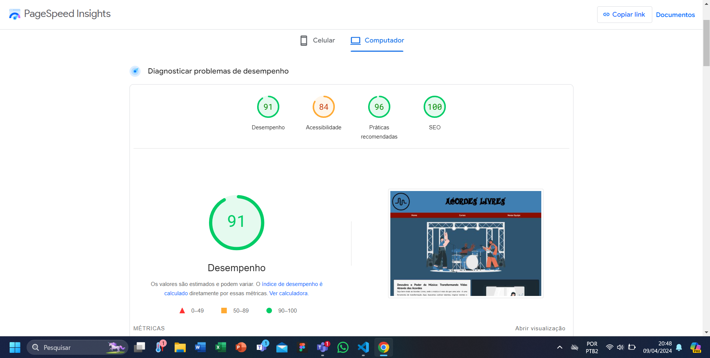

### Projeto Missão: Momento
##
- Descrição: foi proposto que fosse criado uma empresa fictícia com uma missão inspiradora de promover mudanças positivas na sociedade, baseada em valores como empatia, solidariedade e sustentabilidade. Posteriormente, devia ser criado uma landing page completa para essa empresa fictícia.  
- Sobre o projeto: A Acordes Livres é uma empresa fictícia sem fins lucrativos que tem como missão proporcionar educação musical de qualidade e acessível para jovens talentosos. Atuando no ramo de ensino e música, oferecendo aulas gratuitas de diversos instrumentos musicais, além de explorar alguns gêneros musicais como o Rock, Música Clássica e etc. Financiados por nossos generosos parceiros, e com o objetivo de transformar vidas através da música 🎵🎸🥁  
##
<figure>

  <figcaption><a href="https://pagespeed.web.dev/" target="_blank">Site usado para fazer os testes</a></figcaption>
</figure>
